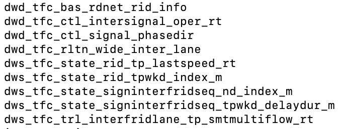
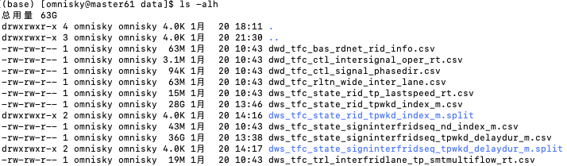
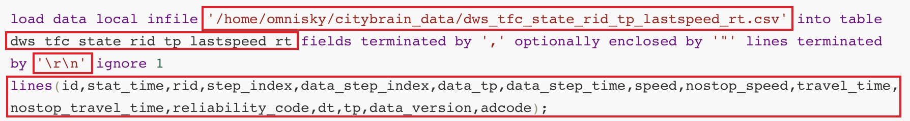

[toc]

## 1. 数据准备

### 1.1 MySQL

#### 1.1.1 基础表名



#### 1.1.2 建库

库名：city_brain

```sql
create database city_brain;
```

#### 1.1.3 建表

以上数据表的建表语句在[city_brain.sql](./table/city_brain.sql)中，下面直接摘出来了，如果有错误，可以到原文件中查。

+ dwd_tfc_bas_rdnet_rid_info

  ```sql
  CREATE TABLE `dwd_tfc_bas_rdnet_rid_info`  (
    `rid` varchar(23) CHARACTER SET utf8 COLLATE utf8_general_ci NOT NULL COMMENT '路段ID',
    `name` varchar(200) CHARACTER SET utf8 COLLATE utf8_general_ci NULL DEFAULT NULL COMMENT 'rid名称，构成格式为x:y-z，其中x为rid所在道路名称，x为与rid起点相交的道路的名称，y为与rid终点相交的道路的名称',
    `len` double NULL DEFAULT NULL COMMENT '路段净长度：米；不含路口长度，路段起点经纬度到路段终点经纬度之间的路段长度',
    `betw_inter_len` double NULL DEFAULT NULL COMMENT '路段(含路口)长度.单位：米，两个路口中心点之间的路段长度',
    `width` double NULL DEFAULT NULL COMMENT '路段宽度，单位：米；取路长度占比较大的link的路宽',
    `max_speed` int NULL DEFAULT NULL COMMENT '最大限速：取link中最大限速km/h ',
    `min_speed` int NULL DEFAULT NULL COMMENT '最小限速：取link中最小限速km/h',
    `angle` double NULL DEFAULT NULL COMMENT '起点路口→终点路口连直线，相对于正北，顺时针方向的角度',
    `dir_4_no` tinyint NULL DEFAULT NULL COMMENT '起点路口id到终点路口id连直线，顺时针方向的角度。1、南向北（<=45或>=315）2、西向东（>45且<=135）3、北向南（>135且<=225）4、东向西（>225且<=315）',
    `dir_8_no` tinyint NULL DEFAULT NULL COMMENT '1、南向北（<=22.5或>=337.5） 2、西南向东北（>22.5且<=67.5） 3、西向东（>67.5且<=112.5） 4、西北向东南（>112.5且<=157.5） 5、北向南（>157.5且<=202.5） 6、东北向西南（<=202.5或>=247.5） 7、东向西（>247.5且<=292.5） 8、东南向西北（>292.5且<=337.5）',
    `road_level` int NULL DEFAULT NULL COMMENT '路段等级；按组成路段的主要link的等级算。取值参照高德道路数据roadclass字段：41000(高速公路)；42000(国道)；43000(城市快速路)；44000(城市主干道)；45000(城市次干道)；47000(城市普通道路)；51000(省道)；52000(县道)；53000(乡道)；54000(县乡村内部道路)；49：小路',
    `rid_type_no` int NULL DEFAULT NULL COMMENT '路段类型包括： 1、主路：（高德link，formway=1,15） 2、辅路：路段中只要有辅路link就算辅路。（高德link，formway=7,11,12,13,14,6,56,58,3, 8,9,10,53,16）',
    `pass_type_no` int NULL DEFAULT NULL COMMENT '-1：暂无数据,1：机动车,2：非机动车,3：机非混合,4：行人',
    `overlap` int NULL DEFAULT NULL COMMENT '指沿着同向行车方向上方有高架，或下方有隧道。 -1：未调查 1：无 2：上方有高架  3：下方有隧道 4：上方既有高架又有隧道',
    `median` int NULL DEFAULT NULL COMMENT '隔离带属性,-1:未调查,1:有物理隔离带但双向道路经纬度串不重叠,2:无隔离带但双向道路经纬度串不重叠,3:有物理隔离带但双向道路经纬度串重叠,4:无隔离带且双向道路经纬度串重叠',
    `walkway` int NULL DEFAULT NULL COMMENT '是否有人行道，-1：未调查 1：有人行道 2：无人行道',
    `fork` int NULL DEFAULT NULL COMMENT '是否有岔口，-1：未调查 1：有岔口 2：无岔口',
    `lane_cnt` int NULL DEFAULT NULL COMMENT 'rid上渠化面长度占比最大的渠化面对应的车道数,若想要rid末端处的车道数,请取lane_cnt_end',
    `p_rid` varchar(23) CHARACTER SET utf8 COLLATE utf8_general_ci NULL DEFAULT NULL COMMENT '独立右转、独立左转和辅路存附属的主路段RID',
    `droad_id` varchar(64) CHARACTER SET utf8 COLLATE utf8_general_ci NULL DEFAULT NULL COMMENT '所属分方向道路',
    `start_cross_id` varchar(11) CHARACTER SET utf8 COLLATE utf8_general_ci NULL DEFAULT NULL COMMENT '起点对象ID,正常情况，路段起点坐标在空间位置和起点路口相连；但独立右转等特殊路段，路段起点坐标和起点路口空间上不相连。',
    `start_cross_type` varchar(10) CHARACTER SET utf8 COLLATE utf8_general_ci NULL DEFAULT NULL COMMENT 'inter、fork',
    `start_lng` double NULL DEFAULT NULL COMMENT '起点经度',
    `start_lat` double NULL DEFAULT NULL COMMENT '起点纬度',
    `start_geohash` varchar(10) CHARACTER SET utf8 COLLATE utf8_general_ci NULL DEFAULT NULL COMMENT '起点经纬度geohash',
    `end_cross_id` varchar(11) CHARACTER SET utf8 COLLATE utf8_general_ci NULL DEFAULT NULL COMMENT '终点路口ID',
    `end_cross_type` varchar(10) CHARACTER SET utf8 COLLATE utf8_general_ci NULL DEFAULT NULL COMMENT 'inter、fork',
    `end_lng` double NULL DEFAULT NULL COMMENT '终点经度',
    `end_lat` double NULL DEFAULT NULL COMMENT '终点纬度',
    `end_geohash` varchar(10) CHARACTER SET utf8 COLLATE utf8_general_ci NULL DEFAULT NULL COMMENT '终点经纬度geohash',
    `lnglat_seq` mediumtext CHARACTER SET utf8 COLLATE utf8_general_ci NULL COMMENT '路段经纬度序列，路段详细坐标字符串，格式：x1,y1;x2,y2;x3,y3;',
    `p_start_inter` varchar(11) CHARACTER SET utf8 COLLATE utf8_general_ci NULL DEFAULT NULL COMMENT '独立右转、独立左转和辅路存附属的主路段的出口道路口',
    `p_end_inter` varchar(11) CHARACTER SET utf8 COLLATE utf8_general_ci NULL DEFAULT NULL COMMENT '独立右转、独立左转和辅路存附属的主路段的进口道路口',
    `openlr_info` varchar(64) CHARACTER SET utf8 COLLATE utf8_general_ci NULL DEFAULT NULL COMMENT '内部字段。把路段编码成openlr点。用于季度版本更新时，查找过滤差分link',
    `rid_func_no` int NULL DEFAULT NULL COMMENT 'rid功能类型编码,取值如下,0:其他,1:独立右转,2:独立左转,3:高架/快速路进口匝道,4:高架/快速路出口匝道,5:高速进口匝道,6:高速出口匝道,7:隧道入口,8:隧道出口,9:桥梁入口,10:桥梁出口,11:隧道主线,12:桥梁主线,13:高架/快速路主线,14:高速主线,15:服务区道路,16:高速进口互通,17:高速出口互通,18:高速直连互通(既是进口也是出口),19:高速中段互通(非进口非出口并且具有互通属性)',
    `lane_cnt_start` int NULL DEFAULT NULL COMMENT 'rid起点处车道数,不包含非机动车道',
    `lane_cnt_end` int NULL DEFAULT NULL COMMENT 'rid终点处车道数,不包含非机动车道',
    `data_version` varchar(8) CHARACTER SET utf8 COLLATE utf8_general_ci NOT NULL COMMENT '数据版本，如20180331',
    `adcode` varchar(20) CHARACTER SET utf8 COLLATE utf8_general_ci NOT NULL COMMENT '城市编码',
    PRIMARY KEY (`rid`, `data_version`) USING BTREE,
    INDEX `endcross_index`(`end_cross_id`, `data_version`) USING BTREE,
    INDEX `startcross_index`(`start_cross_id`, `data_version`) USING BTREE
  ) ENGINE = InnoDB CHARACTER SET = utf8 COLLATE = utf8_general_ci COMMENT = 'rid基本信息' ROW_FORMAT = Dynamic;
  ```

+ dwd_tfc_ctl_intersignal_oper_rt

  ```sql
  CREATE TABLE `dwd_tfc_ctl_intersignal_oper_rt`  (
    `id` bigint NOT NULL AUTO_INCREMENT COMMENT '自增id',
    `inter_id` varchar(64) CHARACTER SET utf8 COLLATE utf8_general_ci NOT NULL COMMENT '路口id',
    `inter_name` varchar(64) CHARACTER SET utf8 COLLATE utf8_general_ci NULL DEFAULT '' COMMENT '路口名称',
    `cycle_start_time` varchar(64) CHARACTER SET utf8 COLLATE utf8_general_ci NOT NULL COMMENT '周期开始时间，格式为yyyy-mm-dd hh:mi:ss',
    `start_time` varchar(64) CHARACTER SET utf8 COLLATE utf8_general_ci NOT NULL COMMENT '相位/阶段实际开始时间-与phase_name对齐，格式为yyyy-mm-dd hh:mi:ss',
    `end_time` varchar(64) CHARACTER SET utf8 COLLATE utf8_general_ci NOT NULL COMMENT '相位/阶段实际结束时间-与phase_name对齐，格式为yyyy-mm-dd hh:mi:ss',
    `phase_plan_id` varchar(64) CHARACTER SET utf8 COLLATE utf8_general_ci NOT NULL COMMENT '相位方案号，与phasedir表对齐',
    `time_plan_id` varchar(64) CHARACTER SET utf8 COLLATE utf8_general_ci NOT NULL COMMENT '配时方案号',
    `phase_name` varchar(64) CHARACTER SET utf8 COLLATE utf8_general_ci NOT NULL COMMENT '相位名称/阶段名称，具体以信号机可接收的为准',
    `split_time` int NULL DEFAULT -1 COMMENT '实际绿信时长，绿信时长=绿灯时长+黄灯时长+全红时长',
    `cycle_time` int NULL DEFAULT -1 COMMENT '相位方案实际周期时长，秒',
    `green_time` int NULL DEFAULT -1 COMMENT '相位/阶段实际绿灯时长,秒-与phase_name对齐',
    `source` varchar(64) CHARACTER SET utf8 COLLATE utf8_general_ci NULL DEFAULT '' COMMENT '数据来源，系统接入或者人工录入等',
    `dt` varchar(64) CHARACTER SET utf8 COLLATE utf8_general_ci NOT NULL COMMENT '日期,yyyymmdd',
    `data_version` varchar(64) CHARACTER SET utf8 COLLATE utf8_general_ci NOT NULL COMMENT '路网数据版本',
    `adcode` varchar(64) CHARACTER SET utf8 COLLATE utf8_general_ci NOT NULL COMMENT '城市编码',
    PRIMARY KEY (`id`) USING BTREE,
    UNIQUE INDEX `uk_default`(`inter_id`, `cycle_start_time`, `start_time`, `phase_plan_id`, `time_plan_id`, `phase_name`, `data_version`) USING BTREE
  ) ENGINE = InnoDB AUTO_INCREMENT = 17260 CHARACTER SET = utf8 COLLATE = utf8_general_ci COMMENT = '信号灯配时实际执行数据' ROW_FORMAT = Dynamic;
  ```

+ dwd_tfc_ctl_signal_phasedir

  ```sql
  CREATE TABLE `dwd_tfc_ctl_signal_phasedir` (
    `id` bigint(20) NOT NULL AUTO_INCREMENT COMMENT '自增主键',
    `inter_id` varchar(32) NOT NULL COMMENT '路口id',
    `inter_name` varchar(64) NOT NULL COMMENT '路口名称',
    `phase_plan_id` varchar(32) NOT NULL COMMENT '相位方案号',
    `phase_name` varchar(32) NOT NULL COMMENT '相位名称/阶段名称，具体以信号机可接收的为准',
    `dir_name` varchar(32) DEFAULT NULL COMMENT '通行方向，如东-直行',
    `f_rid` varchar(64) NOT NULL COMMENT '进口道id',
    `t_rid` varchar(64) NOT NULL COMMENT '出口道rid',
    `f_dir_4_no` tinyint(4) NOT NULL COMMENT '进口道进入路口方向的4方位编码，详见编码表',
    `f_dir_8_no` tinyint(4) NOT NULL COMMENT '进口道进入路口方向的8方位编码，详见编码表',
    `turn_dir_no` tinyint(4) NOT NULL COMMENT '转向，详见编码表',
    `modified_date` varchar(32) NOT NULL COMMENT '修改时间,yyyymmdd',
    `source` varchar(32) NOT NULL COMMENT '数据来源，系统化接入或者人工录入等',
    `start_date` varchar(32) NOT NULL COMMENT '开始时间,yyyymmdd',
    `data_version` varchar(32) NOT NULL COMMENT '路网数据版本',
    `adcode` varchar(32) NOT NULL COMMENT '城市编码',
    PRIMARY KEY (`id`),
    UNIQUE KEY `uk` (`inter_id`,`f_rid`,`t_rid`,`turn_dir_no`,`phase_plan_id`,`phase_name`,`data_version`,`adcode`)
  ) ENGINE=InnoDB AUTO_INCREMENT=495 DEFAULT CHARSET=utf8 COMMENT='路口相位通行方向-最新可用数据表';
  ```

+ dwd_tfc_rltn_wide_inter_lane

  ```sql
  CREATE TABLE `dwd_tfc_rltn_wide_inter_lane` (
    `inter_id` varchar(11) NOT NULL COMMENT '路口id',
    `inter_name` varchar(200) DEFAULT NULL COMMENT '路口名称',
    `lane_id` varchar(30) NOT NULL COMMENT '车道id',
    `lane_no` varchar(10) DEFAULT NULL COMMENT '车道号',
    `turn_dir_no_list` varchar(32) DEFAULT NULL COMMENT '车道转向list，车道转向集合，逗号分隔，例如：1,3,4',
    `lane_angle` double DEFAULT NULL COMMENT '车道相对于正北方向的夹角，0-360',
    `ft_type_no` tinyint(4) DEFAULT NULL COMMENT '进口车道标识 1进口道，2出口道',
    `rid` varchar(23) DEFAULT NULL COMMENT '所属r_id',
    `rid_angle` double DEFAULT NULL COMMENT 'RID相对于正北方向的夹角，0-360',
    `rid_dir_4_no` tinyint(4) DEFAULT NULL COMMENT '路口进出口道4方向编码',
    `rid_dir_8_no` tinyint(4) DEFAULT NULL COMMENT '路口进出口道8方向编码',
    `ft_dir_4_no` tinyint(4) DEFAULT NULL COMMENT 'rid进入(离开)路口方向的4方位编码,详见编码表',
    `ft_dir_8_no` tinyint(4) DEFAULT NULL COMMENT 'rid进入(离开)路口方向的8方位编码,详见编码表',
    `lane_sdtype_no` tinyint(4) DEFAULT NULL COMMENT '标清车道类别:1.路段中车道;2.进口道（进入路口的车道）;3.出口道（驶出路口的车道）',
    `lane_hdtype_no` tinyint(4) DEFAULT NULL COMMENT '高清车道类型:1.机动车道2.非机动车道3.潮汐车道4.可变车道5.公交车道6.应急车道7.左转弯待转区8.对向可变车道',
    `data_version` varchar(8) NOT NULL COMMENT '路网数据版本',
    `adcode` varchar(20) NOT NULL COMMENT '城市编码',
    PRIMARY KEY (`inter_id`,`lane_id`,`data_version`,`adcode`),
    KEY `idx_interid_rid` (`inter_id`,`adcode`,`data_version`,`rid`)
  ) ENGINE=InnoDB DEFAULT CHARSET=utf8 COMMENT='路口车道关系表';
  ```

+ dws_tfc_state_rid_tp_lastspeed_rt

  ```sql
  CREATE TABLE `dws_tfc_state_rid_tp_lastspeed_rt`  (
    `id` bigint NOT NULL AUTO_INCREMENT COMMENT '自增主键',
    `stat_time` varchar(32) CHARACTER SET utf8 COLLATE utf8_general_ci NOT NULL DEFAULT '00000000' COMMENT '业务时间',
    `rid` varchar(64) CHARACTER SET utf8 COLLATE utf8_general_ci NOT NULL DEFAULT '00' COMMENT 'rid',
    `step_index` int NOT NULL DEFAULT -1 COMMENT '业务时间片序号',
    `data_step_index` int NOT NULL DEFAULT -1 COMMENT '数据时间片序号',
    `data_tp` varchar(32) CHARACTER SET utf8 COLLATE utf8_general_ci NOT NULL DEFAULT '2mi' COMMENT '数据指标时间片步长描述如 2mi',
    `data_step_time` varchar(32) CHARACTER SET utf8 COLLATE utf8_general_ci NOT NULL DEFAULT '0000000' COMMENT '数据时间格式 yyyymmddhhmmss，和 data_stap_index 对应，如stat_time = 20180705100000, data_tp = 5mi, data_step_index = 1 ，则data_step_time = 20180704100500',
    `speed` double NOT NULL DEFAULT 0 COMMENT '包含等待红绿灯的行驶速度',
    `nostop_speed` double NOT NULL DEFAULT 0 COMMENT '不包含等待红绿灯的行驶速度',
    `travel_time` double NOT NULL DEFAULT 0 COMMENT '包含等待红绿灯的行驶的通行时间',
    `nostop_travel_time` double NOT NULL DEFAULT 0 COMMENT '不 包含等待红绿灯的行驶通行时间',
    `reliability_code` double NOT NULL DEFAULT 0 COMMENT '置信度',
    `dt` varchar(12) CHARACTER SET utf8 COLLATE utf8_general_ci NOT NULL DEFAULT '00000000' COMMENT '数据日期',
    `tp` varchar(32) CHARACTER SET utf8 COLLATE utf8_general_ci NOT NULL DEFAULT '2mi' COMMENT '计算时间片分区 tp =  2mi',
    `data_version` varchar(32) CHARACTER SET utf8 COLLATE utf8_general_ci NOT NULL DEFAULT '000000' COMMENT '版本号',
    `adcode` varchar(32) CHARACTER SET utf8 COLLATE utf8_general_ci NOT NULL DEFAULT '000000' COMMENT '城市编码',
    PRIMARY KEY (`id`) USING BTREE,
    UNIQUE INDEX `uk_rid_tptime`(`rid`, `data_step_index`, `data_tp`, `tp`, `data_version`) USING BTREE COMMENT '唯一主键'
  ) ENGINE = InnoDB AUTO_INCREMENT = 89736 CHARACTER SET = utf8 COLLATE = utf8_general_ci COMMENT = 'rid最新速度实时表' ROW_FORMAT = Dynamic;
  
  ```

+ dws_tfc_state_rid_tpwkd_index_m

  ```sql
  CREATE TABLE `dws_tfc_state_rid_tpwkd_index_m`  (
    `id` bigint NOT NULL AUTO_INCREMENT COMMENT '自增主键',
    `stat_month` varchar(12) CHARACTER SET utf8 COLLATE utf8_general_ci NULL DEFAULT '' COMMENT '业务月份',
    `rid` varchar(64) CHARACTER SET utf8 COLLATE utf8_general_ci NULL DEFAULT '' COMMENT 'rid',
    `day_of_week` tinyint NULL DEFAULT 0 COMMENT '周几',
    `step_index` int NULL DEFAULT 0 COMMENT '时间片序号',
    `avg_speed_1m` double NULL DEFAULT -1 COMMENT '本月平均等待红绿灯通行速度,km/h',
    `avg_nostop_speed_1m` double NULL DEFAULT -1 COMMENT '本月不等待红绿灯平均通行速度,km/h',
    `avg_travel_time_1m` double NULL DEFAULT -1 COMMENT '本月等待红绿灯平均旅行时间,秒',
    `avg_nostop_travel_time_1m` double NULL DEFAULT -1 COMMENT '本月等待红绿灯平均通行旅行时间,秒',
    `med_speed_1m` double NULL DEFAULT -1 COMMENT '本月等待红绿灯中位数速度,km/h',
    `med_nostop_speed_1m` double NULL DEFAULT -1 COMMENT '本月不等待红绿灯中位数速度,km/h',
    `med_travel_time_1m` double NULL DEFAULT -1 COMMENT '本月等待红绿灯中位数旅行时间,秒',
    `med_nostop_travel_time_1m` double NULL DEFAULT -1 COMMENT '本月不等待红绿灯中位数旅行时间,秒',
    `avg_speed_3m` double NULL DEFAULT -1 COMMENT '近3个月月平均等待红绿灯通行速度,km/h',
    `avg_nostop_speed_3m` double NULL DEFAULT -1 COMMENT '近3个月月不等待红绿灯平均通行速度,km/h',
    `avg_travel_time_3m` double NULL DEFAULT -1 COMMENT '近3个月月等待红绿灯平均旅行时间,秒',
    `avg_nostop_travel_time_3m` double NULL DEFAULT -1 COMMENT '近3个月月等待红绿灯平均通行旅行时间,秒',
    `med_speed_3m` double NULL DEFAULT 0 COMMENT '近3个月等待红绿灯中位数速度,km/h',
    `med_nostop_speed_3m` double NULL DEFAULT -1 COMMENT '近3个月不等待红绿灯中位数速度,km/h',
    `med_travel_time_3m` double NULL DEFAULT -1 COMMENT '近3个月等待红绿灯中位数旅行时间,秒',
    `med_nostop_travel_time_3m` double NULL DEFAULT -1 COMMENT '近3个月不等待红绿灯中位数旅行时间,秒',
    `month` varchar(12) CHARACTER SET utf8 COLLATE utf8_general_ci NULL DEFAULT '' COMMENT '月份',
    `tp` varchar(12) CHARACTER SET utf8 COLLATE utf8_general_ci NULL DEFAULT '' COMMENT '时间分片',
    `data_version` varchar(12) CHARACTER SET utf8 COLLATE utf8_general_ci NULL DEFAULT '' COMMENT '数据版本',
    `adcode` varchar(12) CHARACTER SET utf8 COLLATE utf8_general_ci NULL DEFAULT '' COMMENT '城市编码',
    PRIMARY KEY (`id`) USING BTREE
  ) ENGINE = InnoDB AUTO_INCREMENT = 89066249 CHARACTER SET = utf8 COLLATE = utf8_general_ci COMMENT = 'rid粒度指标汇总表(速度)-时间分片区分周几-月更新' ROW_FORMAT = Dynamic;
  ```

+ dws_tfc_state_signinterfridseq_nd_index_m

  ```sql
  CREATE TABLE `dws_tfc_state_signinterfridseq_nd_index_m`  (
    `id` bigint NOT NULL AUTO_INCREMENT COMMENT '自增ID主键',
    `stat_month` varchar(32) CHARACTER SET utf8 COLLATE utf8_general_ci NULL DEFAULT NULL COMMENT '统计月份,如201701',
    `inter_id` varchar(32) CHARACTER SET utf8 COLLATE utf8_general_ci NULL DEFAULT NULL COMMENT 'inter_id',
    `inter_name` varchar(64) CHARACTER SET utf8 COLLATE utf8_general_ci NULL DEFAULT NULL COMMENT '路口名字',
    `f_ridseq` varchar(1024) CHARACTER SET utf8 COLLATE utf8_general_ci NULL DEFAULT NULL COMMENT '上游序列，第一个rid距离路口最近,最后一个rid距离路口最远',
    `f_ridseq_len` int NULL DEFAULT NULL COMMENT '上游序列长度',
    `f_rid` varchar(64) CHARACTER SET utf8 COLLATE utf8_general_ci NULL DEFAULT NULL COMMENT '进口道id',
    `rid_angle` double NULL DEFAULT NULL COMMENT 'rid相对于正北方向的夹角，0-360',
    `rid_dir_4_no` tinyint NULL DEFAULT NULL COMMENT 'rid自身角度方向的4方位编码,详见编码表',
    `rid_dir_8_no` tinyint NULL DEFAULT NULL COMMENT 'rid自身角度方向的8方位编码,详见编码表',
    `f_angle` double NULL DEFAULT NULL COMMENT 'rid进入路口相对于正北方向的夹角，0-360',
    `f_dir_4_no` tinyint NULL DEFAULT NULL COMMENT 'rid进入路口角度方向的4方位编码,详见编码表',
    `f_dir_8_no` tinyint NULL DEFAULT NULL COMMENT 'rid进入路口角度方向的8方位编码,详见编码表',
    `turn_dir_no` tinyint NULL DEFAULT NULL COMMENT '转向编号',
    `benchmark_nostop_travel_time_3m` double NULL DEFAULT NULL COMMENT '最近3个月上游rid序列不包含等到红绿灯基准旅行时间',
    `benchmark_travel_time_3m` double NULL DEFAULT NULL COMMENT '最近3个月上游rid序列包含等到红绿灯基准旅行时间',
    `benchmark_nostop_speed_3m` double NULL DEFAULT NULL COMMENT '最近3个月上游rid序列不包含等到红绿灯基准行驶速度',
    `benchmark_speed_3m` double NULL DEFAULT NULL COMMENT '最近3个月上游rid序列包含等到红绿灯基准行驶速度',
    `free_nostop_speed_3m` double NULL DEFAULT NULL COMMENT '最近3个月上游rid序列不包含等到红绿灯自由流速度',
    `free_speed_3m` double NULL DEFAULT NULL COMMENT '最近3个月上游rid序列包含等到红绿灯自由流速度',
    `month` varchar(32) CHARACTER SET utf8 COLLATE utf8_general_ci NULL DEFAULT NULL COMMENT '月份，格式如：201701',
    `data_version` varchar(32) CHARACTER SET utf8 COLLATE utf8_general_ci NULL DEFAULT NULL COMMENT '路网数据版本',
    `adcode` varchar(32) CHARACTER SET utf8 COLLATE utf8_general_ci NULL DEFAULT NULL COMMENT '城市编码',
    PRIMARY KEY (`id`) USING BTREE,
    UNIQUE INDEX `uk_inter_frid_td`(`inter_id`, `f_rid`, `turn_dir_no`, `data_version`, `adcode`) USING BTREE
  ) ENGINE = InnoDB AUTO_INCREMENT = 184025 CHARACTER SET = utf8 COLLATE = utf8_general_ci COMMENT = '信号灯路口进口道转向粒度指标汇总(基准旅行时间、基准速度)-月更新' ROW_FORMAT = Dynamic;
  ```

+ dws_tfc_state_signinterfridseq_tpwkd_delaydur_m

  ```sql
  CREATE TABLE `dws_tfc_state_signinterfridseq_tpwkd_delaydur_m`  (
    `id` bigint NOT NULL AUTO_INCREMENT COMMENT '自增主键',
    `stat_month` varchar(64) CHARACTER SET utf8 COLLATE utf8_general_ci NOT NULL DEFAULT '000000' COMMENT '业务月份',
    `inter_id` varchar(64) CHARACTER SET utf8 COLLATE utf8_general_ci NOT NULL DEFAULT '' COMMENT '路口id',
    `inter_name` varchar(64) CHARACTER SET utf8 COLLATE utf8_general_ci NULL DEFAULT NULL COMMENT '路口名称',
    `f_ridseq` text CHARACTER SET utf8 COLLATE utf8_general_ci NULL COMMENT '进口道rid上游序列,第1个rid距离路口最近,分隔符#',
    `f_rid` varchar(64) CHARACTER SET utf8 COLLATE utf8_general_ci NOT NULL COMMENT '进口道rid',
    `f_dir_4_no` int NULL DEFAULT NULL COMMENT 'rid进入路口方向的4方位编码,详见编码表',
    `f_dir_8_no` int NULL DEFAULT NULL COMMENT 'rid进入路口方向的8方位编码,详见编码表',
    `turn_dir_no` int NOT NULL COMMENT '转向编号',
    `day_of_week` int NOT NULL COMMENT '周几',
    `step_index` int NOT NULL COMMENT '时间片序号',
    `avg_speed_3m` double NULL DEFAULT NULL COMMENT '近3个月等待红绿灯平均速度',
    `avg_nostop_speed_3m` double NULL DEFAULT NULL COMMENT '近3个月不等待红绿灯平均速度',
    `avg_speed_travel_time_3m` double NULL DEFAULT NULL COMMENT '近三个月平均不等待红绿灯旅行时间-取自速度表',
    `avg_speed_nostop_travel_time_3m` double NULL DEFAULT NULL COMMENT '近三个月平均不等待红绿灯旅行时间-取自速度表',
    `avg_trace_travel_time_3m` double NULL DEFAULT NULL COMMENT '近三个月平均旅行时间-使用轨迹计算',
    `avg_delay_dur_3m` double NULL DEFAULT NULL COMMENT '近三个月平均延误时间',
    `month` varchar(10) CHARACTER SET utf8 COLLATE utf8_general_ci NOT NULL DEFAULT '' COMMENT '月份',
    `tp` varchar(10) CHARACTER SET utf8 COLLATE utf8_general_ci NOT NULL DEFAULT '' COMMENT '时间片分区',
    `data_version` varchar(64) CHARACTER SET utf8 COLLATE utf8_general_ci NOT NULL COMMENT '数据版本',
    `adcode` varchar(20) CHARACTER SET utf8 COLLATE utf8_general_ci NOT NULL COMMENT '城市编码',
    PRIMARY KEY (`id`) USING BTREE
  ) ENGINE = InnoDB AUTO_INCREMENT = 151000184 CHARACTER SET = utf8 COLLATE = utf8_general_ci COMMENT = '信号灯路口进口道转向粒度指标汇总(旅行时间、延误时长)-时间分片区分周几-月更新' ROW_FORMAT = Dynamic;
  ```

+ dws_tfc_trl_interfridlane_tp_smtmultiflow_rt

  ```sql
  CREATE TABLE `dws_tfc_trl_interfridlane_tp_smtmultiflow_rt`  (
    `id` bigint NOT NULL AUTO_INCREMENT COMMENT '自增id',
    `stat_time` varchar(64) CHARACTER SET utf8 COLLATE utf8_general_ci NULL DEFAULT '' COMMENT '统计时间，yyyymmddhhmiss',
    `reliable_devc_id` varchar(64) CHARACTER SET utf8 COLLATE utf8_general_ci NULL DEFAULT '' COMMENT '置信度最高检测设备id',
    `reliable_devc_type_no` varchar(64) CHARACTER SET utf8 COLLATE utf8_general_ci NULL DEFAULT '' COMMENT '置信度最高检测设备类型编码',
    `lane_id` varchar(64) CHARACTER SET utf8 COLLATE utf8_general_ci NULL DEFAULT '' COMMENT '车道id',
    `rid` varchar(64) CHARACTER SET utf8 COLLATE utf8_general_ci NULL DEFAULT '' COMMENT 'rid',
    `inter_id` varchar(64) CHARACTER SET utf8 COLLATE utf8_general_ci NULL DEFAULT '' COMMENT '路口id，如果是路口设备，则为该路口id，如果是路段设备，则取下游1200米以内的最近路口',
    `step_index` int NULL DEFAULT -1 COMMENT '时间片序号',
    `flow` double NULL DEFAULT -1 COMMENT '流量（-1是特殊值，表示流量数据缺失且无法填充，需要特殊处理）',
    `reliability_code` double NULL DEFAULT -1 COMMENT '置信度',
    `multi_type` varchar(64) CHARACTER SET utf8 COLLATE utf8_general_ci NULL DEFAULT '' COMMENT '融合方式，使用10位开关形式，依赖数据源类型：第一位：高德、第二位：卡口、第三位：微波、第四位：线圈',
    `dt` varchar(64) CHARACTER SET utf8 COLLATE utf8_general_ci NULL DEFAULT '' COMMENT '日期',
    `tp` varchar(64) CHARACTER SET utf8 COLLATE utf8_general_ci NULL DEFAULT '' COMMENT '时间片分区 目前需要计算 tp = 5mi',
    `data_version` varchar(64) CHARACTER SET utf8 COLLATE utf8_general_ci NULL DEFAULT '' COMMENT '路网数据版本',
    `adcode` varchar(64) CHARACTER SET utf8 COLLATE utf8_general_ci NULL DEFAULT '' COMMENT '城市编码',
    PRIMARY KEY (`id`) USING BTREE,
    UNIQUE INDEX `uk_default`(`inter_id`, `rid`, `lane_id`, `dt`, `tp`, `step_index`, `data_version`, `adcode`) USING BTREE
  ) ENGINE = InnoDB AUTO_INCREMENT = 884620 CHARACTER SET = utf8 COLLATE = utf8_general_ci COMMENT = '路口·进口道车道粒度融合后流量平滑结果-时间片-实时更新' ROW_FORMAT = Dynamic;
  ```

#### 1.1.4 导入数据到MySQL

+ 数据文件

  文件上传到了北理集群”/home/omnisky/citybrain/data“下：

  

  上面两个.split文件夹是两张大表的分片，因为大表传输可能会中断，所以做了分片处理，图中已经拼接好了，可以直接用。

+ 执行插入

  + 进入mysql命令行，切换到city_brain数据库；

  + 以”dws_tfc_state_rid_tp_lastspeed_rt“为例，执行：

    ```sql
    load data local infile '/home/omnisky/citybrain_data/dws_tfc_state_rid_tp_lastspeed_rt.csv' into table dws_tfc_state_rid_tp_lastspeed_rt fields terminated by ',' optionally enclosed by '"' lines terminated by '\r\n' ignore 1 lines(id,stat_time,rid,step_index,data_step_index,data_tp,data_step_time,speed,nostop_speed,travel_time,nostop_travel_time,reliability_code,dt,tp,data_version,adcode);
    ```

    

    **注意：插入不同的表时需要注意以上红框四个地方：1、csv文件路径；2、表名；3、换行符（由于历史原因，两张大表换行符是'\n'，其它小表均为'\r\n'）；4、列属性。**

    再以大表”dws_tfc_state_rid_tpwkd_index_m“为例，执行：

    ```sql
    load data local infile '/home/omnisky/citybrain_data/dws_tfc_state_rid_tpwkd_index_m.csv' into table dws_tfc_state_rid_tpwkd_index_m fields terminated by ',' optionally enclosed by '"' lines terminated by '\n' ignore 1 lines(id,stat_month,rid,day_of_week,step_index,avg_speed_1m,avg_nostop_speed_1m,avg_travel_time_1m,avg_nostop_travel_time_1m,med_speed_1m,med_nostop_speed_1m,med_travel_time_1m,med_nostop_travel_time_1m,avg_speed_3m,avg_nostop_speed_3m,avg_travel_time_3m,avg_nostop_travel_time_3m,med_speed_3m,med_nostop_speed_3m,med_travel_time_3m,med_nostop_travel_time_3m,month,tp,data_version,adcode);
    ```
#### 1.1.5 为大表建索引
两张大表查询速度特别慢，所以需要针对flink作业需求建立相关索引。
+ dws_tfc_state_rid_tpwkd_index_m
  ```sql
  create index idx_day_step_tp_rid_att3m on dws_tfc_state_rid_tpwkd_index_m(day_of_week, step_index, tp, rid, avg_travel_time_3m);
  ```
+ dws_tfc_state_signinterfridseq_tpwkd_delaydur_m
  ```sql
  create index idx_day_step_tp_inter_frid_turn_attt3m on dws_tfc_state_signinterfridseq_tpwkd_delaydur_m(day_of_week, step_index, tp, inter_id, f_rid, turn_dir_no, avg_trace_travel_time_3m);
  ```
#### 1.1.6 mock流数据

执行脚本[data_generate.py](./script/data_generate.py)，已经上传到了北理服务器”/home/omnisky/citybrain/script“目录下，因为ssh连接不稳定，为防止中断，最好用以下方式挂起执行：

```shell
nohup python ./data_generate.py &
```

**注意：已经把脚本中的数据库连接信息（host: master61, user: root, password: root）、生成数据片范围（一整天24小时，共1440个时间片）和表名（mock_speed_rt）按照北理服务器适配好。**

#### 1.1.6 把mock的数据导入kafka
+ 为mock的数据流创建topic（以下命令为示例，相关服务信息需根据具体环境适配）
  ```shell
  kafka-topics.sh --zookeeper zookeeper-service:2181 --create --replication-factor 1 --partitions 1 --topic mock_speed_rt
  ```
  
+ 把前面mock的数据表从MySQL导入到kafka

  以下命令会按时间片范围（闭区间）把数据从MySQL导入到kafka，CityBrain-flink.jar可以通过编译flink分支下的本项目获得（可能需要到[cn.edu.neu.citybrain.db.DBConstants](../src/main/java/cn/edu/neu/citybrain/db/DBConstants.java)中修改MySQL连接信息）。
  
  ```shell
  java -cp CityBrain-flink.jar cn.edu.neu.citybrain.connector.kafka.util.Mysql2KafkaV2 --from 0 --to 1439
  ```
### 1.2 Kafka